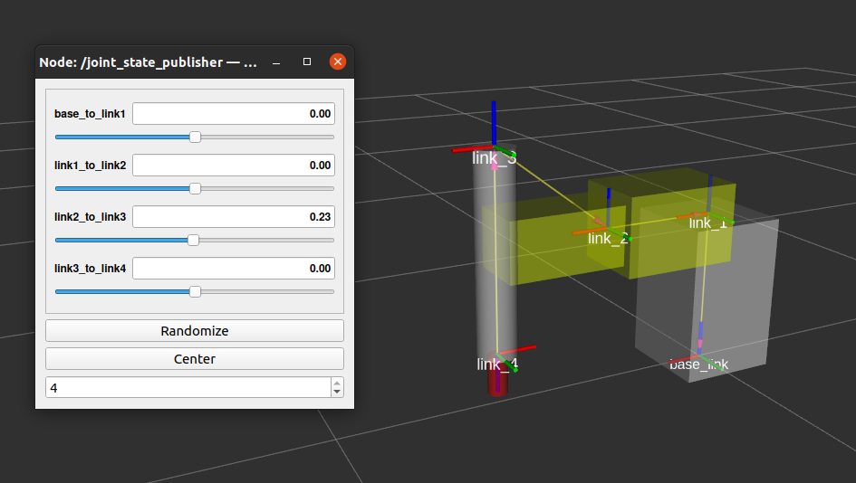
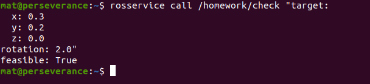
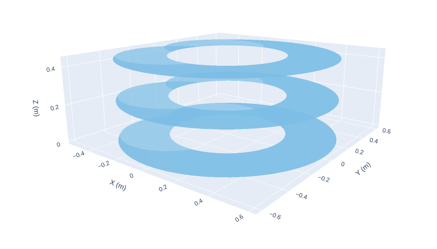
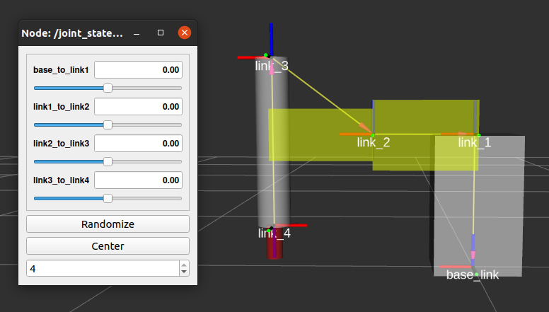
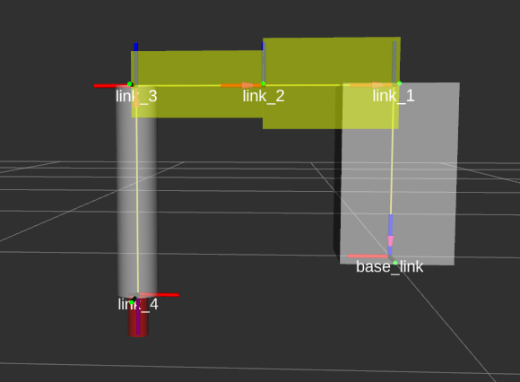
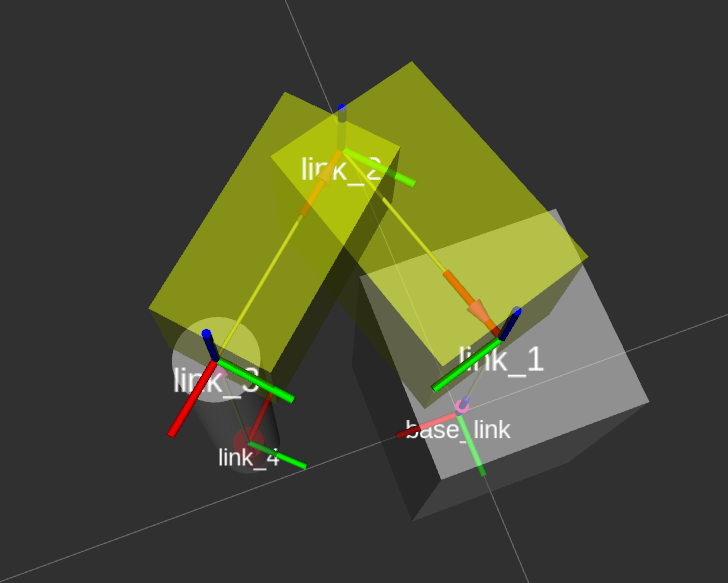

# Homework RPC Module B

Package containing both homeworks, grouped in two main launch files:
```
# Scara URDF + IK feasibility service
roslaunch homework b1.launch

# UR5 MoveIt demo
roslaunch homework b2.launch
```

- Model a SCARA robot with the following characteristics:
  - Link dimensions
    - Link1: H = 0.4 m section 0.25x0.25 m
    - Link2: Li = 0.3 m section 0.2x0.2 m
    - Link3: Lo = 0.3 m section 0.15x0.15 m
    - Link4: L4 = 0.5 m radius 0.05 m

  - Joint limits:
    - J1 (M1 in fig.): range [+2.5, -2.5] rad
    - J2 (M2 in fig.): range [+2.0, -2.0] rad
    - J3 (M3 in fig.): range [0, 0.45] m
    - J4 (M4 in fig.): range [+3, -3] rad

  The URDF file shown on RViz is the following:
  <p align="center">
   
  </p>

- Implement the direct and inverse kinematic.
  Both DK and IK are correctly implemented in Python3

- Implement a ROS service to verify the reachability of a point in the task space

  I have implemented a ROS service which takes as output a point in 3D space and an angle. It returns True if the end effector can reach the requested pose, False if otherwise, by using the IK formula I wrote earlier.

  <p align="center">
   
  </p>

- Characterize the working volume of the robot

  The workspace of a robot arm is the set of all positions that it can reach. I used the DK formula I wrote earlier to compute all the possible positions on the XY plane. The values on the Z axis are influenced only by the prismatic joint.

  <p align="center">
   
  </p>

- Analyze the collisions and singularities of the manipulator

  A singularity occurs when the second joint value is 0, making the link2 aligned with link1.
  <p align="center">
   
  </p>

  If the robot is also placed on a flat surface (like a table, or on the ground), when the prismatic joint is fully extended it actually collides with what's beneath.

  <p align="center">
   
  </p>

  Also, the joint limits on Joint2 should probably be revised, as it appears it may cause a collision between Link2 and Link1.

  <p align="center">
   
  </p>


- MoveIt demo using an UR5 robot, generate the following trajectories:
  - In operational space
  - In joint space
  - With constraints (keep EE orientation)
  - Alongside multiple waypoints
  - Parallel to the XY world plane and with Z coordinates 0.3
  - Avoiding the collision
  - Adding an object to the EE (sort of) and showing that it generates another trajectory

  https://user-images.githubusercontent.com/25968923/125455907-b72af8be-e6d3-4096-9942-0f9852f439da.mp4


